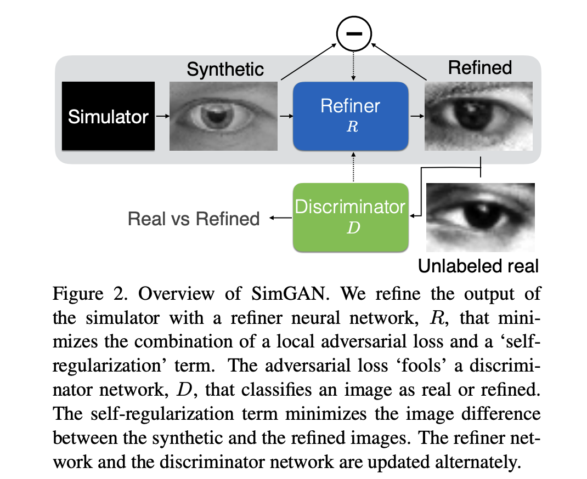

# mipt2024s-5-kulakova-a-d

### задача:
"повышение реалистичности" синтетических изображений штрихкодов (в том числе снимки штрихкодов на экранах, хочется сделать похожими на реальные фото с мобильника)

GAN? 
изображение с 3d модели + аугментации с гана

### renderGAN
https://paperswithcode.com/paper/rendergan-generating-realistic-labeled-data

- идея: генерят параметры для функций аугментаций
   
    

- пример результата:
	
    

### simGAN
https://paperswithcode.com/paper/learning-from-simulated-and-unsupervised

- идея: ган и есть refiner 

    

- пример результата:
	
    
