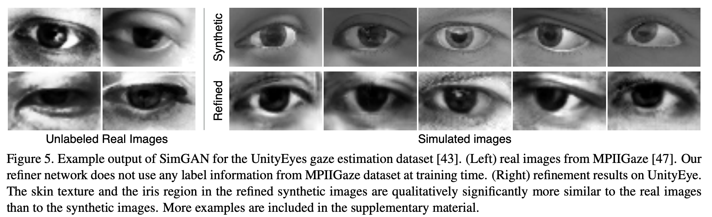
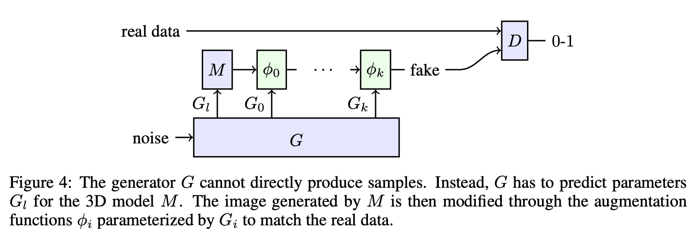
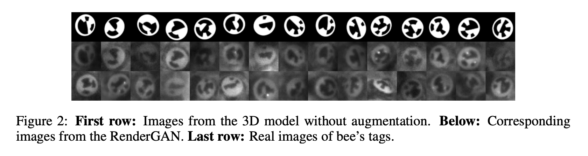

# отчет 20.03.2024

### описание задачи

**задача**: "повышение реалистичности" синтетических изображений штрихкодов (в том числе снимки штрихкодов на экранах, хочется сделать похожими на реальные фото с мобильника)

для решения задачи повышения реалистичности синтетических изображений можно применить следующие методы:
- цветовые искажения (blur, lighting, contrast, colour, etc.)
- летающие стулья
	расположение объекта в случайном месте изображения
- впечатывание
	расположение объекта в рандомном или не очень месте, но с учетом бэкграунда (если не ошибаюсь)
	возможно, тут можно брать реальные изображения с разметкой и в размеченную область подклыдвать саугментированный баркод из синтетических данных (с измененной разметкой класса, если класс баркода отличается)

в качестве возможного решения вижу комбинацию трех этих методов. первым этапом следует обучить gan для повышения реалистичности области самого смоделированного баркода. далее алгоритм помещения баркода или нескольких в случайные места и добавление фона. последний этап состоит из двух парарллельных: летающие стулья и впечатывание. 

### входы, выходы, оценка

**входы**:
1. смоделированные данные баркодов (с разметкой)
2. реальные данные баркодов (с разметкой)
3. датасет с бэкграундами (тут думаю, подойдет coco, imagenet, etc., мне кажется, в данном случае важно чтобы картинки были наименее однотипными)

**выходы**: 
1. преобразованный датасет смоделированных изображений
2. оценка прироста качества

**оценка**:
	оценка прироста целевой метрики при обучении на датасете из реальных+синтетических данных в сравнении с обучением только на реальных данных

### что сейчас в sota

#### simGAN
https://paperswithcode.com/paper/learning-from-simulated-and-unsupervised

- идея: ган и есть refiner. на вход подается синтетическое изображение и преобразовывается ганом.

    

- пример результата:
	
    

#### renderGAN
https://paperswithcode.com/paper/rendergan-generating-realistic-labeled-data

- идея: на вход подается синтетическое изображение, с помощью гана генрируются параметры для функций аугментаций и применяются к картинке + располагают изображение на каком-нибудь фоне.
   
    

- пример результата:
	
    

#### Refining Synthetic Images with Semantic Layouts by Adversarial Training
https://proceedings.mlr.press/v95/zhao18a/zhao18a.pdf

- идея: на вход подается два изображения с разметкой: изображение с целевым "стилем" (реальное изображение, стиль которого хотим перенести на синтетическое) и синтетическое изображение.

    

- пример результата:

    

#### Simple Copy-Paste
https://paperswithcode.com/paper/simple-copy-paste-is-a-strong-data

- идея: расположение объекта или нескольких в случайном месте изображения (летающие стулья)

    простой метод копирования и вставки для создания новых изображений. применяется случайное
    дрожание масштаба к двум случайным обучающим изображениям, а затем случайным образом выбираем подмножество экземпляров из одного изображения для вставки на другое изображение.

- пример результата:

    

### разметка и сбор данных

собрано и размечено (полигоны) 40 изображений баркодов